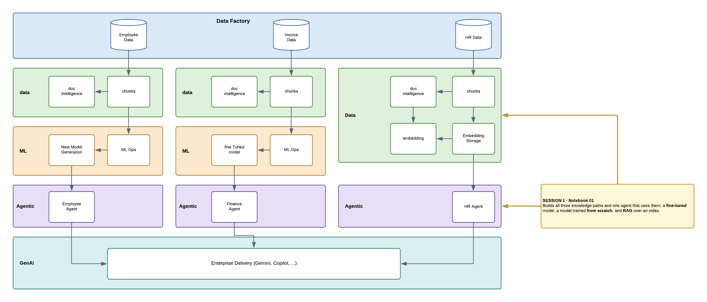

# Session 1 — Architecture & Data

## What this notebook does

The same business question, answered three different ways — because the three ways fail
differently, and you cannot secure what you cannot tell apart.

| Track | Where the knowledge lives | What you see |
|---|---|---|
| **Finance** | fine-tuned adapter weights | `BASE` says "I'd need the document". `TUNED` answers `INV-35089, $47,186.04` with no document in the prompt |
| **Employee** | a 3.2M-parameter model trained from scratch | Right on its ten documents, confident nonsense on anything else |
| **HR** | a vector index, searched at question time | A correct answer **with a filename citation** — and a refusal when the documents do not cover it |

Then you **build your own agent with all three as tools** and watch it choose between them. The
three tracks were never three architectures; they are three tools on one agent.

## The moment to watch for

Ask the fine-tuned model about a vendor that does not exist. It **invents one**, confidently,
because nothing ever taught it that refusing was an option. Then ask the HR agent something its
documents do not cover, and it declines. Same question shape, opposite behaviour — and the only
difference is where the knowledge was put.

## Running it

13 cells, top to bottom. One cell asks for a short name so your agent does not collide with anyone
else's; any name will do. **Run the last cell** — it deletes the agent and vector store you created.
