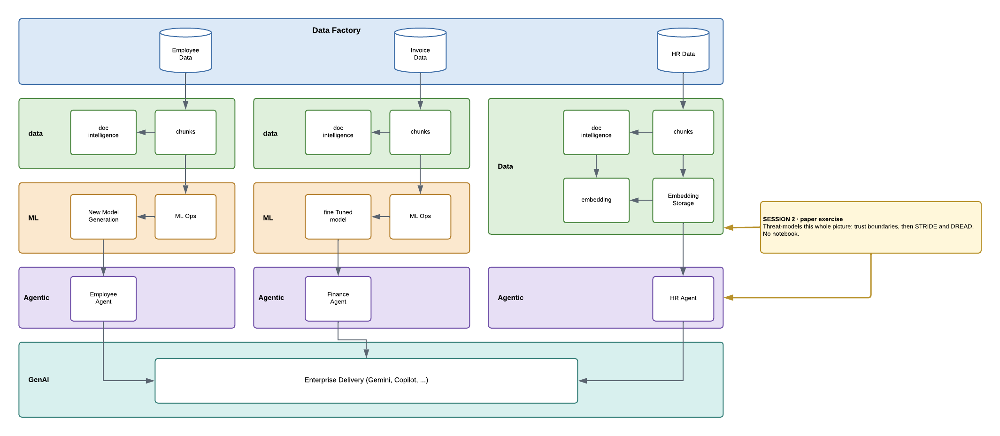

# Session 2 — Threat Modeling

**No notebook. This one is on paper.**

## What you do

Threat-model the agentic architecture above: find the trust boundaries, then work STRIDE and DREAD
across them.

| File | Who it is for |
|---|---|
| `Session2-Threat-Model-Worksheet-HandsOn.pdf` | **attendees** — the blank worksheet |
| `Session2-Threat-Model-Worksheet-Referral.pdf` | **facilitator** — the worked example |

The hands-on sheet supplies the data flow diagram with **three boundaries already marked and four
missing**. Finding the other four is the first half of the exercise; filling in the STRIDE and
DREAD tables is the second.

> Hand out the referral sheet **only at the debrief**. It contains every answer.
