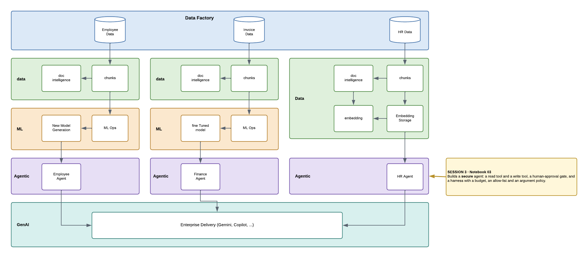

# Session 3 — Security as Developer

## What this notebook does

You build an agent that can do something that actually matters — **approve an expense for payment**
— and then build the controls that stop it doing so when it should not.

The agent gets two deliberately different tools:

| Tool | Runs where | Can you control it? |
|---|---|---|
| read an expense report | **inside Azure** | No — it never comes back to you |
| `approve_expense` | **on your machine** | Yes — Azure pauses and asks your code |

That asymmetry is the whole session. A control you write only works because the dangerous tool has
to come home first.

## The seven parts you assemble

| # | Part | Who supplies it |
|---|---|---|
| 1 | The agent and its two tools | you |
| 2 | **Ask a human** before any write | **Azure, free** |
| 3 | Budget — 6 steps / 20k tokens / 180s | you |
| 4 | Tool allow-list for this task | you |
| 5 | Argument policy — does this report exist, is it too big | you |
| 6 | Audit log of every decision | you |
| 7 | Trace — steps, tokens, timing | Azure |

Only **one** comes free. You write the rest — and then you make each one block something, because a
control you have never watched work is not evidence that it works.

## The four runs

1. A normal lookup — nothing blocks.
2. A report that does not exist → **the policy refuses it on the arguments**; then a real one denied
   by a human, then approved.
3. An amount over the threshold → **refused before any human is even asked**.
4. Several approvals in one turn → **the step budget ends the run**.

## The line it builds to

> A control written into the instructions is a **request**. A control written into the harness is a
> **fact**.

The model can be talked out of the first. It cannot reach the second.

## Running it

14 cells. The approval gate will stop and ask you `approve? [y/N]` — answer it. **Run the last cell**
to delete the agent you built.
